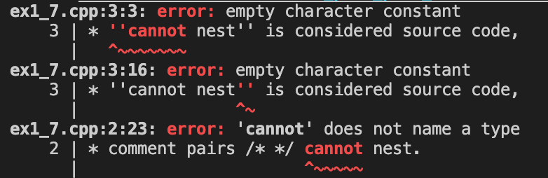

# 第1章 开始
## 练习1.1
> 查阅你使用的编译器的文档，确定它所使用的文件名约定。编译并运行第2页的main程序。
 * [GCC and File Extensions](http://labor-liber.org/en/gnu-linux/development/index.php?diapo=extensions) 
 * [File Types Created for Visual C++ Projects](https://msdn.microsoft.com/en-us/library/3awe4781.aspx)

## 练习1.2
> 改写程序，让它返回-1。返回值-1通常被当做程序错误的标识。重新编译并运行你的程序，观察你的系统如何处理main返回的错误标识。
### Unix
状态返回255? 原因是[这个](https://tldp.org/LDP/abs/html/exitcodes.html)。

## 练习1.3
> 编写程序，在标准输出上打印Hello，World。
```cpp
#include <iostream>

int main() {
    std::cout << "Hello, World" << std::endl;
    return 0;
}
```

## 练习1.4
> 我们的程序使用加法运算符+来将两个数相加。编写程序使用乘法运算符＊，来打印两个数的积。
```cpp
#include <iostream>

int main() {
    std::cout << "Enter two numbers:" << std::endl;
    int v1 = 0, v2 = 0;
    std::cin >> v1 >> v2;
    std::cout << "The product of " << v1 << " and " << v2
              << " is " << v1 * v2 << std::endl;
    return 0;
}
```

## 练习1.5
> 我们将所有输出操作放在一条很长的语句中。重写程序，将每个运算对象的打印操作放在一条独立的语句中。

```cpp
#include <iostream>

int main()
{
    std::cout << "Enter two numbers:" << std::endl;
    int v1 = 0, v2 = 0;
    std::cin >> v1 >> v2;
    std::cout << "The product of ";
    std::cout << v1;
    std::cout << " and ";
    std::cout << v2;
    std::cout << " is ";
    std::cout << v1 * v2;
    std::cout << std::endl;
    return 0;
}
```

## 练习1.6
> 解释下面程序片段是否合法。
> ```cpp
> std::cout << "The sum of " << v1;
>           << " and " << v2;
>           << " is " << v1 + v2 << std::endl;
> ```
不合法。第二行多了个分号。修正：将分号去掉。

## 练习1.7
> 编译一个包含不正确的嵌套注释的程序，观察编译器返回的错误信息

如下：
```cpp
/*
* comment pairs /* */ cannot nest.
* ''cannot nest'' is considered source code,
* as is the rest of the program
*/
int main()
{
    return 0;
}
```
错误信息：


## 练习1.8
> 指出下列哪些输出语句是合法的（如果有的话）：
> ```cpp
> std::cout << "/*";
> std::cout << "*/";
> std::cout << /* "*/" */;
> std::cout << /* "*/" /* "/*" */;
> ```
> 预测编译这些语句会产生什么样的结果，实际编译这些语句来验证你的答案（编写一个小程序，每次将上述一条语句作为其主体），改正每个编译错误。

只有第三行是错的。改成如下：
```cpp
std::cout << /* "*/" */";
```

## 练习1.9
> 编写程序，使用while循环将50到100的整数相加。
```cpp
#include <iostream>
int main() {
    int sum = 0, val = 50;
    while (val <= 100) {
        sum += val;
        val++;
    }
    std::cout << "Sum of 50 to 100 inclusive is "
              << sum << std::endl;
    return 0;
}
```
## 练习1.10
> 除了++运算符将运算对象的值增加1之外，还有一个递减运算符（--）实现将值减少1。编写程序，使用递减运算符在循环中按递减顺序打印出10到0之间的整数。

```cpp
#include <iostream>
int main() {
    int val = 10;
    while (val >= 0) {
        std::cout << val << " ";
        val--;
    }   
    std::cout << std::endl;
    return 0;
}
```

## 练习1.11
> 编写程序，提示用户输入两个整数，打印出这两个整数所指定的范围内的所有整数。

```cpp
#include <iostream>

int main() {
    int start = 0, end = 0;
    std::cout << "Please input two num as range: ";
    std::cin >> start >> end;
    while (start <= end) {
        std::cout << start << " ";
        start++;
    }
    std::cout << std::endl;
    return 0;
}
```

## 练习1.12
> 下面的for循环完成了什么功能？sum的终值是多少？
> ```cpp
> int sum = 0;
> for (int i = -100; i <= 100; ++i)
>   sum += i;
> ```
从-100加到100，sum的终值是0。

## 练习1.13
> 使用for循环重做1.4.1节中的所有练习（第11页）。

### 练习1.9
```cpp
#include <iostream>
int main() {
    int sum = 0;
    for (int val = 50; val <= 100; val++)
        sum+=val;
    std::cout << "Sum of 50 to 100 inclusive is "
              << sum << std::endl;
    return 0;
}
```
### 练习1.10
```cpp
#include <iostream>
int main() {
    int val = 10;
    for (int val = 10; val >= 0; val--) {
        std::cout << val << " ";
    }
    std::cout << std::endl;
    return 0;
}
```

### 练习1.11
```cpp
#include <iostream>

int main() {
    int start = 0, end = 0;
    std::cout << "Please input two num as range: ";
    std::cin >> start >> end;
    for (;start<=end;start++) {
        std::cout << start << " ";
    }
    std::cout << std::endl;
    return 0;
}
```
## 练习1.14
> 对比for循环和while循环，两种形式的优缺点各是什么？

> The main difference between the `for`'s and the `while`'s is a matter of pragmatics: we usually use `for` when there is a known number of iterations, and use `while` constructs when the number of iterations in not known in advance. The `while` vs `do ... while` issue is also of pragmatics, the second executes the instructions once at start, and afterwards it behaves just like the simple while.

## 练习1.15
> 编写程序，包含第14页“再探编译”中讨论的常见错误。熟悉编译器生成的错误信息。

### 语法错误
```cpp
int main(){
    std::cout << "Hello World!" << std::endl // semicolon missed 
    return 0;
}
```
### 类型错误
```cpp
int main(){
    char s = "Hello World!"; // Here char should be std::string
    std::cout << s << endl;
    return 0;
}
```
### 声明错误
```cpp
int main(){
    int k = 0;
    std::cout << K << std::endl; // use of undeclared identifier 'K'
    return 0;
}
```

## 练习1.16
> 编写程序，从cin读取一组数，输出其和。
```cpp
#include <iostream>
int main() {
    int sum = 0;
    for (int val; std::cin >> val; sum += val);
    std::cout << sum << std::endl;
    return 0;
}
```

## 练习1.17
> 如果输入的所有值都是相等的，本节的程序会输出什么？如果没有重复值，输出又会是怎样的？

如果输入值都相等，它将打印一行显示您输入的数字的计数。  
如果没有重复值，它将在每行打印各个数字的计数，且它们都为1次。

## 练习1.18
> 编译并运行本节的程序，给它输入全都相等的值。再次运行程序，输入没有重复的值。

值都相等
> 1 1 1 1 1  
> 1 occurs 5 times

值都不等
> 1 2 3 4 5  
> 1 occurs 1 times  
> 2 occurs 1 times  
> 3 occurs 1 times  
> 4 occurs 1 times  
> 5 occurs 1 times  

## 练习1.19
> 修改你为1.4.1节练习1.11（第11页）所编写的程序（打印一个范围内的数），使其能处理用户输入的第一个数比第二个数小的情况。

```cpp
#include <iostream>

int main() {
    int start = 0, end = 0;
    std::cout << "Please input two num: ";
    std::cin >> start >> end;
    if (start <= end) {
        while (start <= end){
            std::cout << start << " ";
            start++;
        }
        std::cout << std::endl;
    }
    else{
        std::cout << "start should be smaller than end !!!";
    }
    return 0;
}  
```

## 练习1.20
> 在网站[http://www.informit.com/title/0321714113](http://www.informit.com/title/0321714113)上，第1章的代码目录中包含了头文件Sales_item.h。将它拷贝到你自己的工作目录中。用它编写一个程序，读取一组书籍销售记录，将每条记录打印到标准输出上。

```cpp
#include <iostream>
#include "Sales_item.h"

int main()
{
	for (Sales_item item; std::cin >> item; std::cout << item << std::endl);
	return 0;
}
```

## 练习1.21
> 编写程序，读取两个ISBN相同的Sales_item对象，输出它们的和。
```cpp
#include <iostream>
#include "include/Sales_item.h"

using std::cin;
using std::cout;
using std::endl;

int main()
{
    Sales_item item1, item2;
    cin >> item1 >> item2;
    cout << item1 + item2 << endl;
    return 0;
}
```
## 练习1.22
> 编写程序，读取多个具有相同ISBN的销售记录，输出所有记录的和。
```cpp
#include <iostream>
#include "include/Sales_item.h"

using std::cin;
using std::cout;
using std::endl;

int main()
{
    Sales_item sum;
    if (cin >> sum) {
        Sales_item temp;
        while (cin >> temp) {
            if (sum.isbn() == temp.isbn()) {
                sum += temp;
            } else {
                cout << sum << endl;
                sum = temp;
            }
        }
        cout << sum << endl;
    } else {
        std::cerr << "No data" << endl;
        return -1;
    }
    return 0;
}
```

## 练习1.23
> 编写程序，读取多条销售记录，并统计每个ISBN（每本书）有几条销售记录。
```cpp
#include <iostream>
#include "include/Sales_item.h"
int main()
{
    Sales_item currItem, valItem;
    if (std::cin >> currItem)
    {
        int cnt = 1;
        while (std::cin >> valItem)
        {
            if (valItem.isbn() == currItem.isbn())
            {
                ++cnt;
            }
            else
            {
                std::cout << currItem << " occurs " << cnt << " times " << std::endl;
                currItem = valItem;
                cnt = 1;
            }
        }
        std::cout << currItem << " occurs "<< cnt << " times " << std::endl;
    }
    return 0;
}
```

## 练习1.24
> 输入表示多个ISBN的多条销售记录来测试上一个程序，每个ISBN的记录应该聚在一起。

运行结果
> 0-201-78345-X 3 60 20 occurs 2 times  
> 0-201-78345-Y 3 60 20 occurs 1 times  
> 0-201-78345-Z 2 50 25 occurs 1 times  